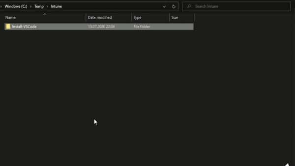
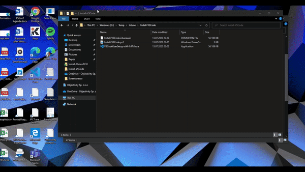

# Intune-App-Sandbox

This tool is for testing Powershell Script which is packed using [Win32 Content Prep Tool](https://github.com/microsoft/Microsoft-Win32-Content-Prep-Tool) for installing software using Win32 Deployment profile in Intune.

# Installing

To configure tool on your device `Clone` this repo and run `Add-SandboxShell.ps1`.

It will create folder - `C:\SandboxEnvironment` where all neccessary items will be stored.
You will be also prompt to choose which context menu items you wish to apply.
1. Run test in Sandbox
1. Pack with IntunewinUtil
1. Both

# How to use
Packing script and all neccessary executables is as simple as creating parent folder which is named exacly the same as `.ps1` script inside.<br>
Then right-click on folder and pick `Pack with IntunewinUtil`.
<br><br>

<br><br><br><br><br><br><br>
To test your package just right-click on `.intunewin` file and choose
`Run test in Sandbox`


# Technical details
Selected `.intunewin` file is pasted into Logon Command for Windows Sandbox.
Eg. you have Restart-Device.intune, then logon command will as below
```powershell
If (!(Test-Path -Path C:\Temp -PathType Container))
{
	New-Item -Path C:\Temp -ItemType Directory
}
Copy-Item -Path "C:\Users\WDAGUtilityAccount\Desktop\Restart-Device\Restart-Device.intunewin" -Destination C:\Temp
$Decoder = Start-Process -FilePath C:\Users\WDAGUtilityAccount\Desktop\bin\IntuneWinAppUtilDecoder.exe -ArgumentList "C:\Temp\Restart-Device.intunewin /s" -NoNewWindow -PassThru -Wait

Rename-Item -Path "C:\Temp\Restart-Device.intunewin.decoded" -NewName 'Restart-Device.zip' -Force;
Expand-Archive -Path "C:\Temp\Restart-Device.zip" -Destination C:\Temp -Force;
Remove-Item -Path "C:\Temp\Restart-Device.zip" -Force;

# register script as scheduled task
$Trigger = New-ScheduledTaskTrigger -Once -At $(Get-Date).AddMinutes(1)
$User = "SYSTEM"
$Action = New-ScheduledTaskAction -Execute "powershell.exe" -Argument '-ex bypass "powershell {& C:\Temp\Restart-Device.ps1};New-Item C:\Temp\$Lastexitcode.code -force"'
$Settings = New-ScheduledTaskSettingsSet -ExecutionTimeLimit "01:00" -AllowStartIfOnBatteries
Register-ScheduledTask -TaskName "Install App" -Trigger $Trigger -User $User -Action $Action -Settings $Settings -Force
```
This package is decoded within Sandbox environment.
Decoded contents are then expanded and to path `C:\Temp`.
Then Scheduled Task is created which will start `Powershell` within `Powershell` to run script contents.
Thanks to nesting `Powershell` runspaces after script ends, `$LASTEXITCODE` is saved in form of file at script location.
